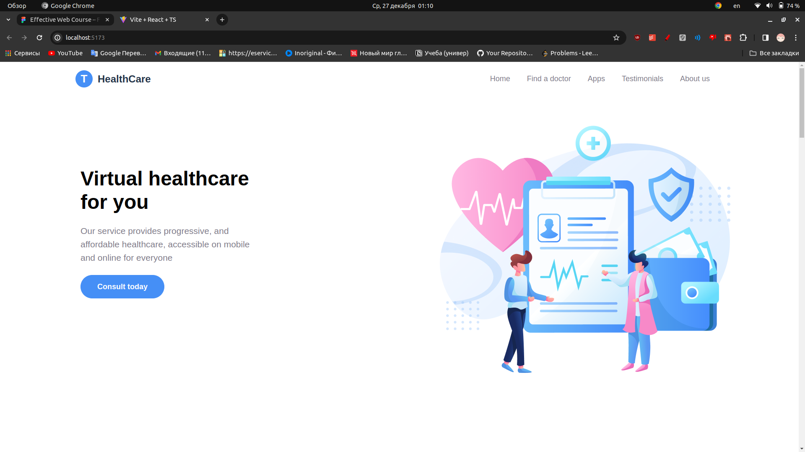
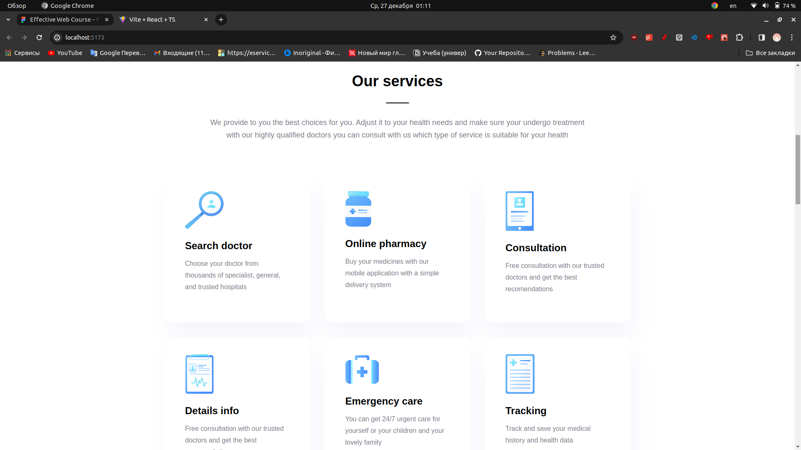
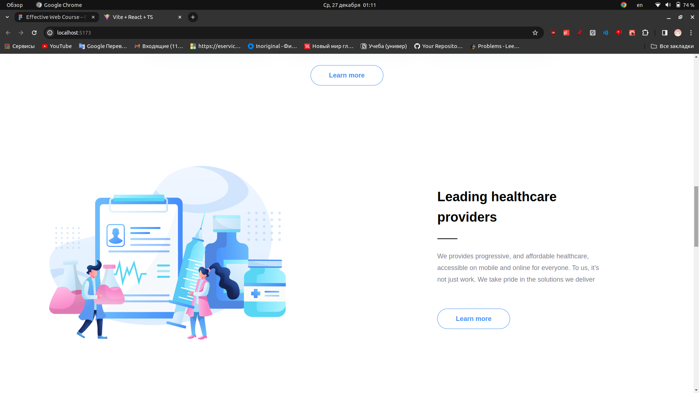
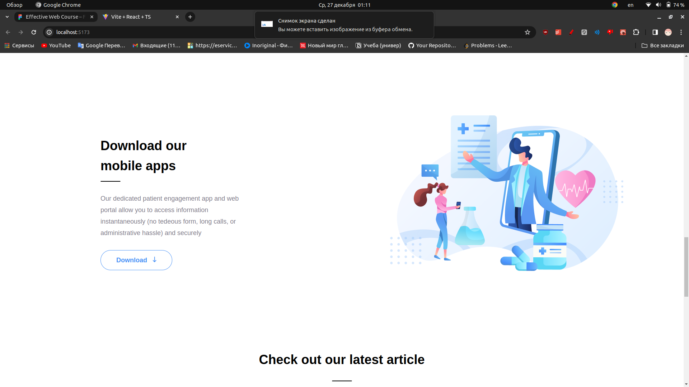
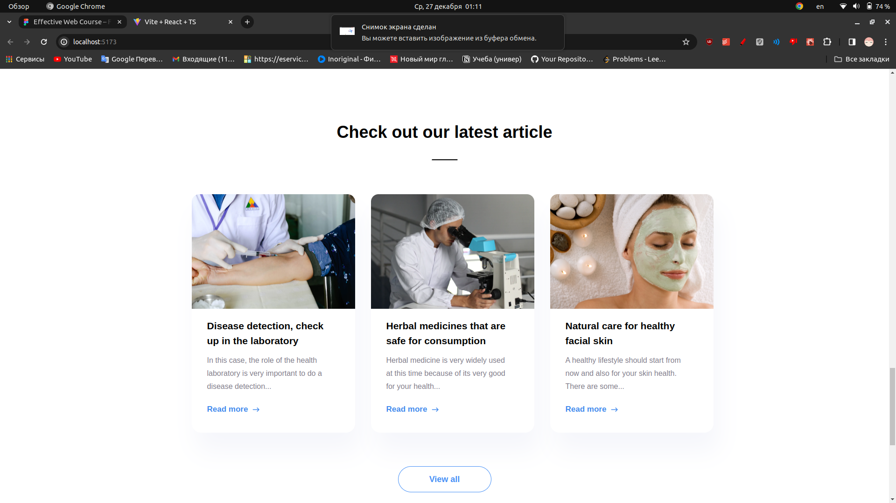
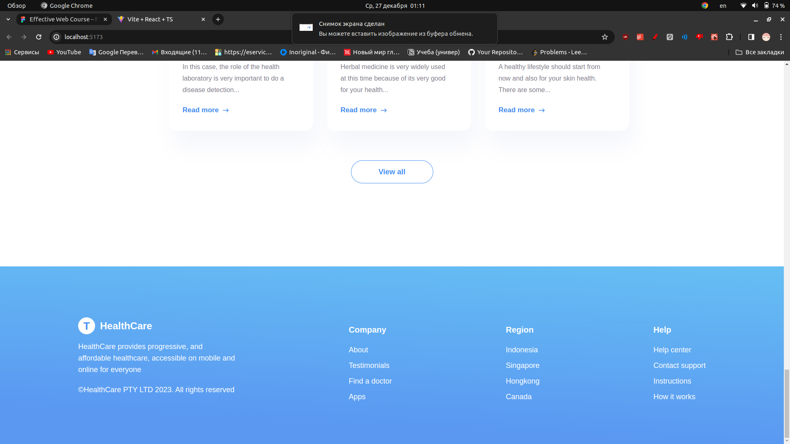

# Web Lab1: React + TypeScript
### Версия npm 10.2.5; версия node 20.10.0
### Заранее прошу прощения, если жестоко нарушил какие-то конвенции веб-разработчиков по именованию файлов, компонентов и стилей 🥺
### По структуре проекта делал так: на каждый компонент отдельная папка, в которой лежит сам компонент и файл со стилями для него.
### Пробовал также использовать интерфейсы и выносил перечисление одинаковых компонентов в отдельный файл в виде массива.
### Также пытался сделать верстку адаптивной, применял flexbox.
### Сделал слайдер и кнопку, которая все статьи раскрывает :smirk_cat:
### Скрины работы:

